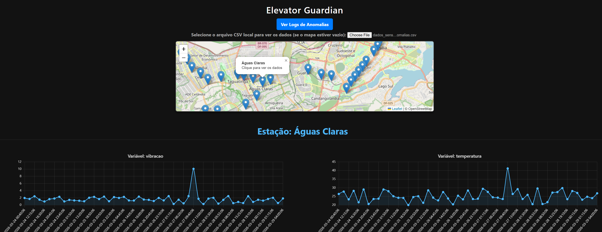

### Protótipo Funcional para Monitoramento de Ocorrências nas Estações de Metrô

- Mapa Interativo: A primeira página exibe o mapa de Brasília e permite a análise detalhada de uma estação específica.
- Registros (Logs): A página de logs possibilita filtrar ocorrências de acordo com os dados captados pelos sensores.
- Simulação de Dados: O arquivo .csv simula sensores que identificariam falhas técnicas ou eventos suspeitos de vandalismo nos equipamentos.

